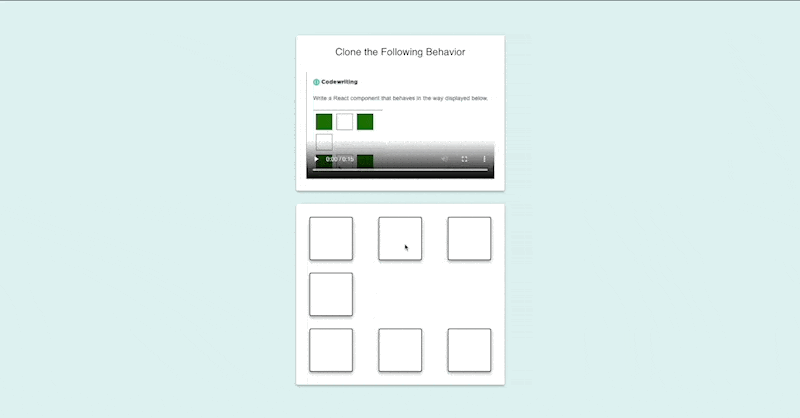

# Uber Interview 🚘

In this repository, the solution is given for the task that was given in an interview at Uber for **Senior Software Engineer** position.

## Demo 📀



## Task Description 🗒️

- Display boxes as shown in the video (order of boxes is important)
- Initially all boxes are unchecked (not green)
- User can click these boxes one by one in any order
- Once all boxes are checked (green) they start getting unchecked themselves until all gets unchecked (not green)
- Make sure boxes gets unchecked in the reverse order as user clicked them

## Setup ⚙️

Following instructions will get you a copy of the project up and running on your local machine for development purpose.

1.  Install following on your local machine
    - [Git](https://git-scm.com)
    - [Node.js](https://nodejs.org/en/download/) (which comes with [npm](http://npmjs.com))
2.  Clone the repository by running this following command
    ```bash
    git clone https://github.com/asadkhalid305/uber-interview.git
    ```
3.  Start project by running following commands
    ```bash
    cd uber-interview/
    npm install

    # once node_modules gets install, run this command
    npm start
    ```
4.  Once your app is running, you can access it on the following address in your browser
    [http://localhost:3000](http://localhost:3000)

## Versions ☝️

Following versions are being used while creating this guide.

```
git@2.x.x or higher
node@v16.x.x or higher
npm@6.x.x or higher
```

## About Me 😎

_My name is Asad Ullah Khalid and I am BS(CS) graduated. Professionally I am a Full-stack Web engineer majorly Frontend focused with 4+ years of experience working with JavaScript and its frameworks like VueJs, ReactJs, NodeJs, along with SQL and NoSQL databases and by my passion I am a tech speaker, trainer, and mentor along with contributor to Open-Source._
